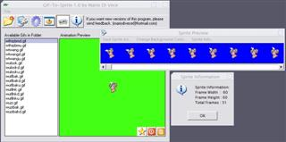

## Gif\-To\-Sprite 1\.0 full features

### Description

Last week I submitted the first version of Gif-To-Sprite. Well, here it is, the new and improved Gif-To-Srite that supports jpg saving with quality options, bmp save, no frame overlapping, animation preview, background color change and even Batch processing... If you are a games programmer, or just want to see each frame of an animated gif, be sure to check this full-featured app. Thanks darkbasic community for encouraging me to develop this new version.

If ijl11.dll was removed YOU NEED IT to save to Jpeg
 
### More Info
 

             |
---                |---
**Submitted On**   |2002-04-17 15:39:40
**By**             |[Mario A\. Di Vece](https://github.com/Planet-Source-Code/PSCIndex/blob/master/ByAuthor/mario-a-di-vece.md)
**Level**          |Intermediate
**User Rating**    |4.9 (49 globes from 10 users)
**Compatibility**  |VB 6\.0
**Category**       |[Graphics](https://github.com/Planet-Source-Code/PSCIndex/blob/master/ByCategory/graphics__1-46.md)
**World**          |[Visual Basic](https://github.com/Planet-Source-Code/PSCIndex/blob/master/ByWorld/visual-basic.md)
**Archive File**   |[Gif\-To\-Spr730014172002\.zip](https://github.com/Planet-Source-Code/mario-a-di-vece-gif-to-sprite-1-0-full-features__1-33889/archive/master.zip)

